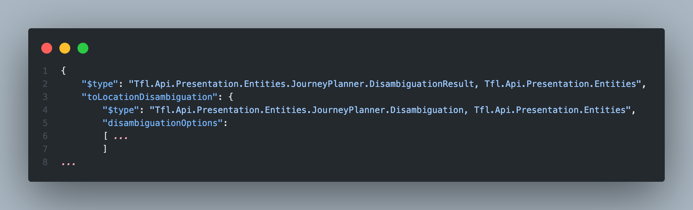
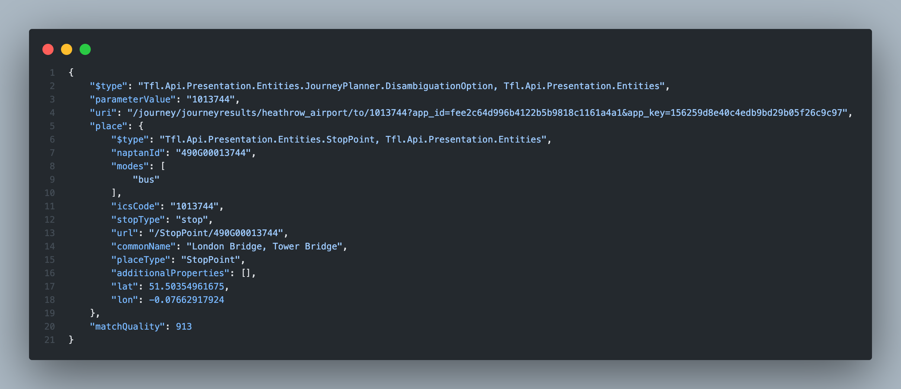
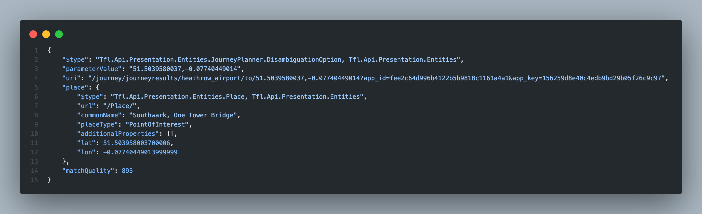

# HTTP Error: 300 Multiple Choices on the Transport for London (TfL) API.

## __Introduction__

When accessing a web server or application, every HTTP request that is received by a server is responded to with an HTTP status code. HTTP status codes are three-digit codes and are grouped into five different classes. The class of a status code can be identified by its first digit:

1xx: Informational\
2xx: Success\
3xx: Redirection\
4xx: Client Error\
5xx: Server Error

This guide focuses on identifying and troubleshooting when encountering HTTP 300 error codes. The example is given based on the [Transport for London (TfL) API](https://api.tfl.gov.uk).

### __Section 1__

Let's plan the journey from Heathrow Airport to Tower Bridge using a Bus and Tube and see which way is faster.

When making the HTTP request using literal words, the following code would be returned:



This code means that this API cannot find the given location by provided keywords (location identifiers).

### __Section 2__

The HTTP status code 300 indicates the Multiple Choices option response. It means that additional action is required on the user side in order to complete the request by choosing one of the provided options.

As a part of the response message, TfL API includes disambiguationOptions. Each of these options may have its own weight (match quality), allowing us to choose the most precise location using this property. You can see 2 examples below:



And with lower match quality:



We can continue making requests manually until we reach the final result, but we are developers and always like to automate things. 

### __Section 3__

Let’s look at the following example.


``` python
resource = 'journey/journeyresults'
resource_from = 'Heathrow_Airport'
resource_to = 'Tower_Bridge'

def find_highest_match_uri(data):
    highestMatch = {
        'matchQuality': 0,
        'uri': ''
    }

    next_uri = ''

    for option in data['disambiguationOptions'] :
        if option['matchQuality'] > highestMatch['matchQuality'] :
            highestMatch = option
    
    next_uri = highestMatch['uri'] 
    
    return next_uri

def get_route(mode):
    query = f'?app_id={app_id}&app_key={app_key}' 
    query = f'{query}&mode={mode}' 

    response = requests.get(f'{host}/{resource}/{resource_from}/to/{resource_to}{query}')
    data = response.json()
    
    while True :
        if 'journeys' in data:
            break

        location_disambiguation = {}

        if 'toLocationDisambiguation' in data and data['toLocationDisambiguation']['matchStatus'] == 'list':
            location_disambiguation = data['toLocationDisambiguation']

        if 'fromLocationDisambiguation' in data and data['fromLocationDisambiguation']['matchStatus'] == 'list':
            location_disambiguation = data['fromLocationDisambiguation']


        next_uri = find_highest_match_uri(location_disambiguation)
        data = requests.get(f'{host}{next_uri}').json()
    return data

```

In the **find_highest_match_uri** function, we choose the highest match to the provided location and can receive the final result below without any user taking part in an HTTP request.

### __Section 4__

Let's find the faster way from Heathrow Airport to Tower Bridge using a Bus and Tube:

``` python
bus_route = get_route('bus')
tube_route = get_route('tube')

def get_route_options(routs):
    options = []
    
    for route in routs:
        options.append(route['duration'])
    options.sort()
    return options

bus_route_options_min = min(get_route_options(bus_route['journeys']))
tube_route_options_min = min(get_route_options(tube_route['journeys']))

print('Planned duration:')
print(f'Bus: {bus_route_options_min} minutes')
print(f'Tube: {tube_route_options_min} minutes','\n')

bus_route_options_all = get_route_options(bus_route['journeys'])
tube_route_options_all = get_route_options(tube_route['journeys'])

print('Planned all possible duration:')
print(f'Bus: {bus_route_options_all} minutes')
print(f'Tube: {tube_route_options_all} minutes')
```

The output would be:

```shell
Planned duration:
Bus: 141 minutes
Tube: 82 minutes 
```

### __Conclusion__

Now as you are familiar with the HTTP 300 status code and an optional solution to this, you can improve and automate your next project with TfL API.
